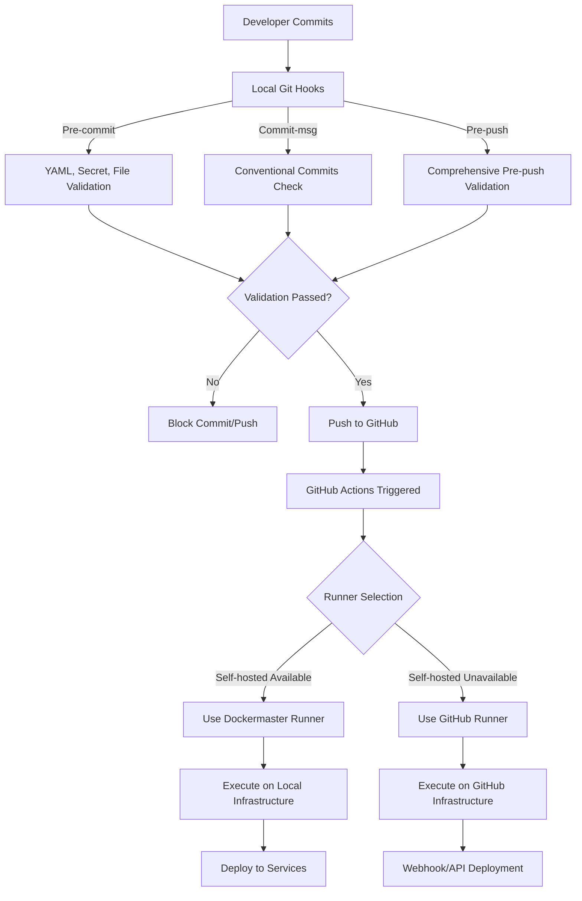

# CI/CD Architecture

## Overview

The Home Lab Inventory repository uses a hybrid CI/CD architecture that combines GitHub-hosted and self-hosted runners for maximum flexibility and reliability.

## Architecture Components

### 1. Local CI with Git Hooks

The repository includes a comprehensive git hooks system that provides local CI validation before code reaches the remote repository:

#### Pre-commit Hook
- **YAML Validation**: Validates GitHub Actions workflows and Docker Compose files
- **Secret Detection**: Scans for hardcoded secrets, API keys, and sensitive data
- **File Validation**: Checks file types, sizes, and enforces repository policies
- **Code Quality**: Syntax checking for shell scripts, Python, and JSON files
- **Integration**: Works alongside existing pre-commit framework

#### Commit-msg Hook
- **Conventional Commits**: Validates commit messages against conventional commits specification
- **Integration**: Seamlessly integrates with existing commitlint/Husky setup
- **Flexible**: Falls back to custom validation if commitlint unavailable

#### Pre-push Hook
- **Comprehensive Validation**: Runs all pre-commit checks plus additional validations
- **Commit History**: Validates all commit messages being pushed
- **Secret Scanning**: Deep scan of all changed files in pushed commits
- **Testing**: Optionally runs available test suites
- **Workflow Validation**: Comprehensive GitHub Actions workflow validation

### 2. GitHub Actions Runners

#### GitHub-Hosted Runners
- **Purpose**: Fallback and public-facing workflows
- **Specs**: Ubuntu latest, 2-core CPU, 7GB RAM
- **Use Cases**:
  - PR validation
  - Security scanning
  - Documentation builds
  - Public artifact generation

#### Self-Hosted Runner (Dockermaster)
- **Purpose**: Internal deployments and private operations
- **Location**: Dockermaster server (`192.168.59.x`)
- **Container**: `github-runner-homelab`
- **Image**: `myoung34/github-runner:latest`
- **Network**: docker-servers-net (macvlan)
- **Specs**: 2 CPU limit, 4GB RAM limit, 512MB minimum
- **Labels**: `self-hosted`, `linux`, `x64`, `dockermaster`, `docker`
- **Use Cases**:
  - Direct deployment to local services
  - Building private Docker images
  - Access to internal networks via macvlan
  - Integration with Portainer and local Docker services
  - Read-only access to deployment paths

### 3. Workflow Strategy



### 4. Local CI Integration

The git hooks system integrates seamlessly with GitHub Actions:

- **Early Detection**: Catches issues locally before they reach CI/CD pipeline
- **Reduced Pipeline Failures**: Pre-validation reduces GitHub Actions failures
- **Faster Feedback**: Immediate validation during development
- **Cost Optimization**: Fewer failed GitHub Actions runs
- **Security**: Secrets never leave local environment during scanning

#### Hook-to-Actions Mapping

| Git Hook | Equivalent GitHub Actions Check |
|----------|--------------------------------|
| pre-commit YAML validation | `.github/workflows/validate.yml` |
| pre-commit secret detection | `.github/workflows/security.yml` |
| commit-msg validation | Commitlint action in workflows |
| pre-push testing | Test workflows in GitHub Actions |

### 5. Deployment Methods

#### Direct Deployment (Self-hosted)
- Runner has direct access to Docker socket
- Can manage local containers directly
- No network hops required
- Instant deployment capability

#### Webhook Deployment (GitHub-hosted)
- Triggers deployment via webhook
- Requires webhook receiver on dockermaster
- Adds security layer between GitHub and infrastructure

#### SSH Deployment (Both)
- Uses SSH keys for remote deployment
- Works from any runner type
- Requires SSH access configuration

## Security Architecture

### Token Management
```yaml
Secrets:
  GITHUB_TOKEN: Personal Access Token or App Token
  DOCKERHUB_TOKEN: Registry authentication
  GHCR_TOKEN: GitHub Container Registry
  SERVER_SSH_KEY: SSH deployment key
  WEBHOOK_TOKEN: Webhook authentication
```

### Network Security
- Self-hosted runner in isolated Docker network
- Read-only mount for deployment paths
- No direct internet exposure
- Outbound only to GitHub API

### Access Control
- Runner operates with limited permissions
- Repository-scoped tokens only
- Deployment paths mounted read-only
- Resource limits enforced

## Workflow Patterns

### Pattern 1: Build and Deploy
```yaml
name: Build and Deploy
on:
  push:
    branches: [main]

jobs:
  build:
    runs-on: ubuntu-latest  # Public build
    steps:
      - uses: actions/checkout@v4
      - name: Build Docker image
        run: docker build -t app:latest .
      - name: Push to registry
        run: docker push app:latest

  deploy:
    needs: build
    runs-on: [self-hosted, dockermaster]  # Private deploy
    steps:
      - name: Deploy to production
        run: docker compose up -d
```

### Pattern 2: PR Validation
```yaml
name: PR Validation
on:
  pull_request:
    types: [opened, synchronize]

jobs:
  validate:
    runs-on: ubuntu-latest  # Always use GitHub runner for PRs
    steps:
      - uses: actions/checkout@v4
      - name: Run tests
        run: ./scripts/test.sh
```

### Pattern 3: Hybrid Deployment
```yaml
name: Hybrid Deploy
on:
  workflow_dispatch:

jobs:
  deploy:
    runs-on: ${{ matrix.runner }}
    strategy:
      matrix:
        runner:
          - ubuntu-latest
          - [self-hosted, dockermaster]
      fail-fast: false  # Continue if one runner fails
    steps:
      - name: Deploy
        run: ./deploy.sh
```

## Monitoring and Observability

### Runner Health Monitoring
- Health check every 30 seconds
- Automatic restart on failure
- Logs shipped to central logging
- Metrics exported to Prometheus

### Workflow Metrics
- Success/failure rates
- Deployment frequency
- Build times
- Resource usage

### Alerting
- Runner offline alerts
- Deployment failure notifications
- Resource limit warnings
- Security scan findings

## Disaster Recovery

### Runner Failure
1. Workflows automatically fallback to GitHub runners
2. Manual intervention to restart self-hosted runner
3. Investigate logs for root cause
4. Apply fixes and restore service

### Deployment Rollback
1. Keep previous deployment configs
2. Version all Docker images
3. Automated rollback on health check failure
4. Manual rollback via workflow dispatch

## Best Practices

### 1. Runner Selection
- Use self-hosted for internal operations
- Use GitHub-hosted for public operations
- Always provide fallback options
- Monitor runner availability

### 2. Secret Management
- Never commit secrets
- Rotate tokens regularly
- Use repository secrets for sensitive data
- Limit token scopes

### 3. Workflow Design
- Keep workflows simple and focused
- Use reusable workflows
- Implement proper error handling
- Add comprehensive logging

### 4. Resource Management
- Set appropriate resource limits
- Clean up old artifacts
- Monitor disk usage
- Regular maintenance windows

## Scaling Considerations

### Horizontal Scaling
- Add more self-hosted runners
- Use runner groups for organization
- Implement load balancing
- Auto-scaling based on queue depth

### Vertical Scaling
- Increase runner resources as needed
- Optimize Docker layer caching
- Use build caches effectively
- Parallelize where possible

## Future Enhancements

### Short Term
- [ ] Add Kubernetes runner for container orchestration
- [ ] Implement GitOps with ArgoCD
- [ ] Add more comprehensive monitoring
- [ ] Implement automatic runner updates

### Long Term
- [ ] Multi-region runner deployment
- [ ] Advanced deployment strategies (blue-green, canary)
- [ ] Cost optimization analytics
- [ ] AI-powered deployment decisions

## References

- [GitHub Actions Documentation](https://docs.github.com/en/actions)
- [Self-hosted Runners Guide](https://docs.github.com/en/actions/hosting-your-own-runners)
- [Docker in GitHub Actions](https://docs.docker.com/ci-cd/github-actions/)
- [Security Best Practices](https://docs.github.com/en/actions/security-guides)
