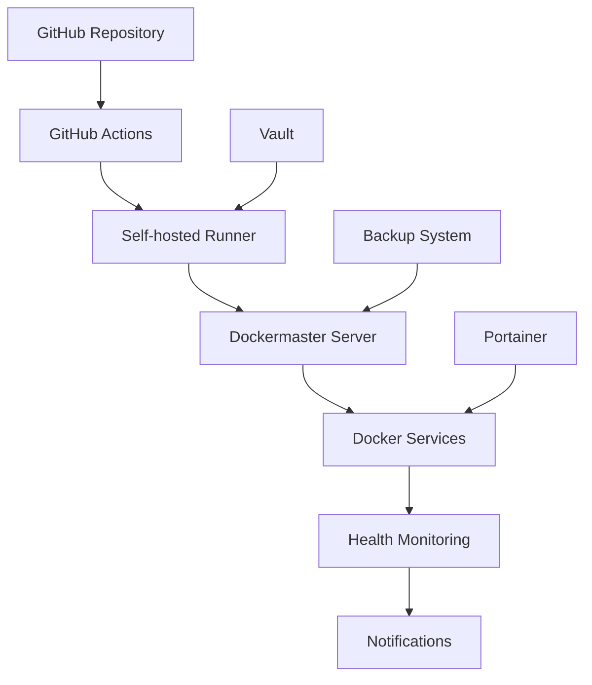

# Dockermaster CI/CD Pipeline Documentation

## 📊 Overview

The Dockermaster CI/CD Pipeline provides comprehensive automated deployment, health monitoring, and rollback capabilities for all dockermaster services. This pipeline integrates with GitHub Actions, Vault secret management, and self-hosted runners to deliver reliable and secure deployments.

## 🏗️ Architecture

### Pipeline Components



### Key Features

- **🚀 Automated Deployments**: Zero-downtime deployments with comprehensive validation
- **🏥 Health Monitoring**: Continuous service health checks with automated alerting
- **🔄 Rollback Automation**: Automatic rollback on deployment failures
- **🔐 Secret Management**: Integrated Vault support for secure secret handling
- **📊 Performance Tracking**: Deployment metrics and performance monitoring
- **📢 Notification System**: Automated notifications for deployment status

## 🔧 Workflow Files

### Primary Workflows

| Workflow | Purpose | Triggers | Duration |
|----------|---------|----------|----------|
| `dockermaster-deployment.yml` | Main deployment pipeline | Manual, post-build | 10-15 min |
| `service-health-monitor.yml` | Continuous health monitoring | Schedule (15 min), manual | 2-5 min |
| `emergency-rollback.yml` | Emergency rollback procedures | Manual only | 5-8 min |

### Supporting Workflows

| Workflow | Purpose | Integration |
|----------|---------|-------------|
| `deploy.yml` | Legacy deployment (enhanced) | Webhook, SSH, Watchtower |
| `build-images.yml` | Docker image building | Triggers deployment |
| `pr-validation.yml` | PR validation and testing | Quality gates |
| `security.yml` | Security scanning | Continuous security |

## 🚀 Deployment Pipeline

### Main Deployment Workflow: `dockermaster-deployment.yml`

#### Stage 1: Pre-deployment Validation
- **Duration**: 2-3 minutes
- **Activities**:
  - Environment validation (Docker, network, disk space)
  - Vault authentication and secret loading
  - Service discovery and validation
  - Backup creation of current state

#### Stage 2: Parallel Service Deployment
- **Duration**: 5-10 minutes (depending on service count)
- **Strategy**: Maximum 3 services in parallel
- **Activities**:
  - Image pulling with timeout protection
  - Zero-downtime rolling deployment
  - Container status verification
  - Resource usage monitoring

#### Stage 3: Health Checks & Validation
- **Duration**: 2-5 minutes
- **Activities**:
  - Container health verification
  - Service-specific endpoint checks
  - Network connectivity testing
  - Extended validation for critical services

#### Stage 4: Rollback (if needed)
- **Duration**: 3-5 minutes
- **Triggers**: Deployment failure or health check failure
- **Activities**:
  - Automatic backup restoration
  - Service restart with previous configuration
  - Rollback verification

#### Stage 5: Notifications & Reporting
- **Duration**: 1-2 minutes
- **Activities**:
  - GitHub deployment status updates
  - Notification dispatch
  - Performance metrics collection
  - Cleanup operations

### Deployment Inputs

```yaml
services:
  description: 'Services to deploy (comma-separated, or "all")'
  default: 'all'

environment:
  description: 'Deployment environment'
  options: ['production', 'staging']

skip_health_checks:
  description: 'Skip post-deployment health checks'
  type: boolean

enable_rollback:
  description: 'Enable automatic rollback on failure'
  default: true
```

### Service Discovery

The pipeline automatically discovers services based on:
- Presence of `docker-compose.yml` files in `/nfs/dockermaster/docker/`
- Active container status
- Service configuration validation

## 🏥 Health Monitoring System

### Continuous Health Monitoring: `service-health-monitor.yml`

#### Monitoring Schedule
- **Frequency**: Every 15 minutes (configurable)
- **Coverage**: All active dockermaster services
- **Alerting**: Automatic issue creation for failures

#### Health Check Types

1. **Container Health**
   - Container running status
   - Docker health check results
   - Resource utilization

2. **Service Endpoints**
   - Service-specific API health checks
   - Response time monitoring
   - Connectivity validation

3. **Network Connectivity**
   - External network access
   - Internal service communication
   - DNS resolution

#### Alert Thresholds

| Service Status | Criteria | Action |
|---------------|----------|--------|
| Healthy | All checks pass | Continue monitoring |
| Degraded | Some issues but functional | Warning notification |
| Unhealthy | Service accessible but failing checks | Alert after 2 failures |
| Down | Service completely inaccessible | Immediate alert |

### Health Check Results

Results are available in multiple formats:
- **Table**: Human-readable status overview
- **JSON**: Machine-readable for automation
- **Summary**: Brief status counts

Example health check output:
```
Service              Status        Containers   Endpoint     Network    CPU%
--------            -------       -----------   --------     -------    ----
vault               ✅ healthy    2/2          healthy      healthy    15.2
portainer           ✅ healthy    1/1          healthy      healthy    8.7
github-runner       ⚠️ degraded   1/1          unhealthy    healthy    22.1
```

## 🔄 Emergency Rollback System

### Emergency Rollback Workflow: `emergency-rollback.yml`

#### Rollback Targets

1. **Last Known Good**: Most recent successful backup
2. **Previous Deployment**: Second most recent backup
3. **Specific Backup**: User-specified backup ID
4. **Git Commit**: Rollback to specific commit state

#### Rollback Process

1. **Preparation Phase**
   - Validate rollback request
   - Locate rollback source
   - Create pre-rollback state capture

2. **Execution Phase**
   - Stop current services gracefully
   - Restore configuration from backup
   - Restart services with previous configuration

3. **Verification Phase**
   - Verify rollback success
   - Perform health checks
   - Update deployment status

#### Emergency Triggers

```bash
# Emergency rollback examples
gh workflow run emergency-rollback.yml \
  -f services="vault,portainer" \
  -f rollback_target="last-known-good" \
  -f reason="Security incident - immediate rollback required"

gh workflow run emergency-rollback.yml \
  -f services="all" \
  -f rollback_target="git-commit" \
  -f git_commit="abc123def456" \
  -f reason="Revert to stable release"
```

## 🔐 Vault Integration

### Secret Management Architecture

```
secret/dockermaster/
├── github-runner/
│   ├── github-token
│   └── webhook-secret
├── vault/
│   ├── root-token
│   └── unseal-keys
├── portainer/
│   ├── admin-password
│   └── jwt-secret
└── [service-name]/
    ├── database/
    ├── api-keys/
    └── certificates/
```

### Vault Authentication Methods

1. **AppRole Authentication** (Recommended for CI/CD)
   ```bash
   # Setup AppRole for service
   scripts/cicd/vault-integration.sh setup-approle github-runner
   ```

2. **Token Authentication** (Manual operations)
   ```bash
   # Authenticate with token
   VAULT_TOKEN=hvs.xxx scripts/cicd/vault-integration.sh auth
   ```

### Secret Operations

```bash
# Get service secrets
scripts/cicd/vault-integration.sh get-secret github-runner/github-token

# Set service secrets
scripts/cicd/vault-integration.sh set-secret vault/admin-password password=secure123

# Generate .env file from Vault
scripts/cicd/vault-integration.sh generate-env github-runner -o .env
```

### Integration in Workflows

```yaml
- name: Load secrets from Vault
  run: |
    # Authenticate with Vault
    scripts/cicd/vault-integration.sh auth

    # Load secrets for service
    scripts/cicd/vault-integration.sh generate-env ${{ matrix.service }} -o .env

    # Use secrets in deployment
    docker compose --env-file .env up -d
```

## 📊 Performance Metrics & Tracking

### Deployment Metrics

| Metric | Target | Measurement |
|--------|---------|-------------|
| Total Deployment Time | < 10 minutes | Workflow duration |
| Service Deployment Time | < 5 minutes | Per-service timing |
| Health Check Time | < 3 minutes | Validation duration |
| Rollback Time | < 5 minutes | Recovery duration |

### Performance Tracking

1. **Deployment Reports**
   ```json
   {
     "service": "vault",
     "deployment": {
       "status": "success",
       "time_seconds": 180,
       "backup_id": "backup-20250829-143022"
     },
     "health_check": {
       "status": "passed",
       "time_seconds": 45
     }
   }
   ```

2. **GitHub Step Summaries**
   - Deployment overview with timings
   - Resource usage metrics
   - Service status dashboard
   - Quick access links

3. **Performance Monitoring**
   - Historical deployment times
   - Success/failure rates
   - Resource utilization trends
   - Alert frequency analysis

## 🛠️ CLI Tools & Scripts

### Deployment Script: `scripts/cicd/deploy-service.sh`

Comprehensive service deployment with health checks and rollback capability.

```bash
# Basic deployment
scripts/cicd/deploy-service.sh vault

# Deployment with options
scripts/cicd/deploy-service.sh \
  --verbose \
  --timeout 900 \
  --vault-token hvs.xxx \
  portainer

# Dry run
scripts/cicd/deploy-service.sh --dry-run --skip-backup nginx-rproxy
```

#### Features
- ✅ Environment validation
- ✅ Vault secret integration
- ✅ Automatic backup creation
- ✅ Zero-downtime deployment
- ✅ Comprehensive health checks
- ✅ Automatic rollback on failure
- ✅ Detailed logging and reporting

### Health Check Script: `scripts/cicd/health-check.sh`

Standalone health monitoring with multiple output formats.

```bash
# Check all services
scripts/cicd/health-check.sh

# Check specific services with JSON output
scripts/cicd/health-check.sh -j --detailed vault portainer

# Continuous monitoring
scripts/cicd/health-check.sh -c -i 30

# Export health status for monitoring systems
scripts/cicd/health-check.sh --format json > /tmp/health-status.json
```

#### Features
- ✅ Multi-service health checking
- ✅ Container and endpoint validation
- ✅ Resource usage metrics
- ✅ Network connectivity testing
- ✅ Continuous monitoring mode
- ✅ Multiple output formats
- ✅ Alert threshold configuration

### Vault Integration Script: `scripts/cicd/vault-integration.sh`

Complete Vault secret management for CI/CD pipelines.

```bash
# Authenticate with Vault
scripts/cicd/vault-integration.sh auth

# Manage secrets
scripts/cicd/vault-integration.sh get-secret github-runner/github-token
scripts/cicd/vault-integration.sh set-secret vault/admin password=newpass

# Setup AppRole for service
scripts/cicd/vault-integration.sh setup-approle calibre-server

# Generate environment files
scripts/cicd/vault-integration.sh generate-env portainer -o /tmp/portainer.env
```

#### Features
- ✅ Multiple authentication methods
- ✅ CRUD operations for secrets
- ✅ AppRole management
- ✅ Environment file generation
- ✅ Health checking
- ✅ Token lifecycle management

## 📢 Notification System

### Notification Channels

1. **GitHub Issues**
   - Automatic issue creation for health alerts
   - Emergency rollback incident tracking
   - Issue closure on resolution

2. **GitHub Deployments**
   - Deployment status tracking
   - Environment-specific deployment history
   - Integration with GitHub UI

3. **Workflow Summaries**
   - Rich markdown summaries with metrics
   - Quick access links to management interfaces
   - Performance and status dashboards

### Alert Escalation

```
Level 1: Service Degraded
├── Continue monitoring
└── Warning notification

Level 2: Service Unhealthy (3 consecutive failures)
├── Create GitHub issue
├── Assign to repository owner
└── Email notification (if configured)

Level 3: Critical Service Down
├── Create urgent GitHub issue
├── Emergency contact notification
└── Escalation to on-call team
```

### Notification Templates

#### Health Alert Issue Template
```markdown
# 🚨 Service Health Alert: 2 Critical Services

**Alert Time:** 2025-08-29T14:30:15Z
**Workflow:** [Service Health Monitor](https://github.com/luiscamaral/home-lab-inventory/actions/runs/12345)

## 🚨 Critical Services (2)

### vault
- **Status:** unhealthy
- **Containers:** 2/2 running
- **Issues:**
  - Vault API endpoint unreachable

### portainer
- **Status:** down
- **Containers:** 0/1 running
- **Issues:**
  - Container not running

## 🔗 Quick Links
- [Portainer Dashboard](https://192.168.59.2:9000)
- [Vault UI](http://vault.d.lcamaral.com/ui)
- [Service Health Monitor](https://github.com/luiscamaral/home-lab-inventory/actions/workflows/service-health-monitor.yml)
```

#### Emergency Rollback Issue Template
```markdown
# 🚨 EMERGENCY ROLLBACK ✅ - vault, portainer

**Status:** ✅ Emergency rollback completed successfully
**Emergency ID:** emergency-20250829-143022-12345
**Initiated by:** luiscamaral
**Timestamp:** 2025-08-29T14:30:22Z
**Workflow:** [Emergency Rollback](https://github.com/luiscamaral/home-lab-inventory/actions/runs/12346)

## 📋 Rollback Details

**Reason:** Security incident - immediate rollback required
**Target:** last-known-good
**Services:** vault, portainer

## 🔍 Execution Results

- **Rollback Execution:** ✅ Success
- **Post-Rollback Verification:** ✅ Passed

## 🔗 Quick Links
- [Portainer Dashboard](https://192.168.59.2:9000)
- [Vault UI](http://vault.d.lcamaral.com/ui)
- [Workflow Run](https://github.com/luiscamaral/home-lab-inventory/actions/runs/12346)
```

## 🎯 Best Practices

### Deployment Best Practices

1. **Pre-deployment Checks**
   - Always validate environment before deployment
   - Ensure sufficient disk space and resources
   - Verify network connectivity and dependencies

2. **Backup Strategy**
   - Create backups before every deployment
   - Retain backups for at least 7 days
   - Test backup restoration regularly

3. **Health Check Implementation**
   - Define comprehensive health checks for each service
   - Include both technical and business health indicators
   - Set appropriate timeouts and retry logic

4. **Rollback Procedures**
   - Enable automatic rollback for production deployments
   - Test rollback procedures regularly
   - Document manual rollback steps

### Security Best Practices

1. **Secret Management**
   - Store all secrets in Vault
   - Use AppRole authentication for CI/CD
   - Rotate secrets regularly
   - Never commit secrets to version control

2. **Access Control**
   - Limit who can trigger emergency rollbacks
   - Use GitHub branch protection rules
   - Implement approval workflows for critical changes

3. **Audit Logging**
   - Log all deployment activities
   - Track secret access and modifications
   - Monitor for unusual deployment patterns

### Monitoring Best Practices

1. **Health Check Coverage**
   - Monitor all critical service components
   - Include dependency health checks
   - Set appropriate alert thresholds

2. **Performance Monitoring**
   - Track deployment performance trends
   - Monitor resource usage during deployments
   - Set performance regression alerts

3. **Incident Response**
   - Define clear escalation procedures
   - Document common troubleshooting steps
   - Maintain up-to-date contact information

## 🚨 Troubleshooting Guide

### Common Issues

#### Deployment Failures

**Issue**: Deployment times out during image pull
```bash
# Solution 1: Check network connectivity
docker exec github-runner-homelab ping -c 3 registry-1.docker.io

# Solution 2: Increase timeout
DEPLOYMENT_TIMEOUT=1200 scripts/cicd/deploy-service.sh vault

# Solution 3: Manual image pull
docker compose pull --ignore-pull-failures
```

**Issue**: Container fails to start after deployment
```bash
# Check container logs
docker compose logs --tail=50 service-name

# Check resource usage
docker stats --no-stream

# Validate configuration
docker compose config
```

#### Health Check Failures

**Issue**: Service endpoint unreachable
```bash
# Test endpoint manually
curl -v http://vault.d.lcamaral.com:8200/v1/sys/health

# Check container network
docker exec container-name ip route show

# Verify port mapping
docker compose ps --format table
```

**Issue**: Network connectivity problems
```bash
# Test external connectivity
docker exec container-name ping -c 3 8.8.8.8

# Check DNS resolution
docker exec container-name nslookup google.com

# Verify network configuration
docker network inspect docker-servers-net
```

#### Vault Integration Issues

**Issue**: Vault authentication fails
```bash
# Check Vault health
curl -s http://vault.d.lcamaral.com:8200/v1/sys/health | jq .

# Verify AppRole credentials
scripts/cicd/vault-integration.sh auth --verbose

# Test token validity
curl -H "X-Vault-Token: $VAULT_TOKEN" \
     http://vault.d.lcamaral.com:8200/v1/auth/token/lookup-self
```

### Emergency Procedures

#### Complete Service Outage

1. **Immediate Response**
   ```bash
   # Trigger emergency rollback for all services
   gh workflow run emergency-rollback.yml \
     -f services="all" \
     -f rollback_target="last-known-good" \
     -f reason="Complete service outage"
   ```

2. **Investigation**
   - Check dockermaster server health
   - Verify network connectivity
   - Review recent changes and deployments

3. **Recovery**
   - Restore from backup if needed
   - Restart services manually if required
   - Update monitoring systems

#### Rollback Failure

1. **Manual Rollback**
   ```bash
   # Navigate to service directory
   cd /nfs/dockermaster/docker/service-name

   # Stop current containers
   docker compose down --timeout 30

   # Restore from backup
   cp /tmp/backup-id/service-name-docker-compose.yml.bak docker-compose.yml

   # Restart with backup configuration
   docker compose up -d
   ```

2. **Verification**
   ```bash
   # Check service health
   scripts/cicd/health-check.sh service-name

   # Verify functionality
   curl -f http://service-endpoint/health
   ```

## 📚 References

### Documentation Links
- [GitHub Actions Documentation](https://docs.github.com/en/actions)
- [Docker Compose Reference](https://docs.docker.com/compose/)
- [HashiCorp Vault Documentation](https://www.vaultproject.io/docs)
- [Portainer Documentation](https://docs.portainer.io/)

### Internal Documentation
- [Service Matrix](./service-matrix.md) - Complete service inventory
- [Vault Integration Plan](./vault-integration-plan.md) - Vault setup guide
- [Portainer GitOps](./portainer-gitops.md) - Portainer integration

### Quick Access Links
- [GitHub Actions Workflows](https://github.com/luiscamaral/home-lab-inventory/actions)
- [Portainer Dashboard](https://192.168.59.2:9000)
- [Vault UI](http://vault.d.lcamaral.com/ui)
- [Service Health Monitor](https://github.com/luiscamaral/home-lab-inventory/actions/workflows/service-health-monitor.yml)

---

**Document Version**: 1.0  
**Last Updated**: 2025-08-29  
**Created by**: Phase 6 CI/CD Pipeline Enhancement  
**Status**: Production Ready
