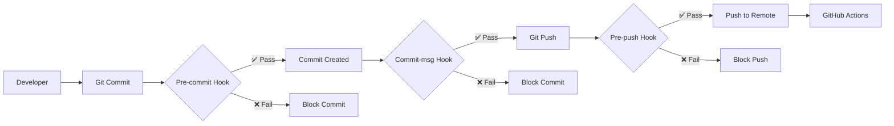

# Local CI with Git Hooks

## Overview

The Home Lab Inventory repository includes a comprehensive git hooks system that provides local continuous integration validation before code reaches the remote repository. This system works alongside GitHub Actions to catch issues early and reduce CI/CD pipeline failures.

## Architecture



## Git Hooks Components

### 1. Pre-commit Hook

**Purpose**: Validates changes before they are committed locally.

**Validations**:
- **YAML Syntax**: Validates `.yml` and `.yaml` files including GitHub Actions workflows and Docker Compose files
- **Secret Detection**: Scans for hardcoded secrets, API keys, tokens, and sensitive data using pattern matching
- **File Validation**: Checks file types, sizes, and enforces repository policies
- **Code Quality**: Basic syntax checking for shell scripts, Python, and JSON files
- **Integration**: Works alongside existing pre-commit framework without conflicts

**Performance**: 2-10 seconds depending on number of changed files

### 2. Commit-msg Hook

**Purpose**: Validates commit messages against conventional commits specification.

**Features**:
- **Conventional Commits**: Enforces format like `feat(scope): description`
- **Integration**: Seamlessly integrates with existing commitlint/Husky setup
- **Flexible**: Falls back to custom validation if commitlint unavailable
- **Helpful**: Provides clear guidance when validation fails

**Examples**:
```bash
# ✅ Valid commit messages
feat(docker): add nginx reverse proxy container
fix(security): resolve secret detection in workflows
docs(inventory): update server documentation
ci(github): add self-hosted runner support
chore: update dependencies and cleanup code

# ❌ Invalid commit messages
Updated some stuff
fix bug
Added new feature.
FEAT: New Docker Container
wip: work in progress
```

**Performance**: < 1 second

### 3. Pre-push Hook

**Purpose**: Comprehensive validation before code is pushed to remote repository.

**Validations**:
- **All Pre-commit Checks**: Runs complete pre-commit validation suite
- **Commit History**: Validates all commit messages being pushed
- **Deep Secret Scanning**: Thorough scan of all changed files in pushed commits
- **Testing**: Optionally runs available test suites (can be skipped with `SKIP_TESTS=true`)
- **Workflow Validation**: Comprehensive GitHub Actions workflow syntax and security validation

**Performance**: 5-60 seconds depending on changes and test suite

## Installation and Setup

### Quick Setup

```bash
# From repository root
cd /path/to/home-lab-inventory
.githooks/setup.sh
```

### Advanced Setup Options

```bash
# Force overwrite existing hooks
.githooks/setup.sh --force

# Quiet installation
.githooks/setup.sh --quiet

# Skip backing up existing hooks
.githooks/setup.sh --no-backup
```

### Manual Installation

```bash
# Copy hooks to git hooks directory
cp .githooks/hooks/* .git/hooks/
chmod +x .git/hooks/*

# Verify installation
ls -la .git/hooks/pre-commit .git/hooks/commit-msg .git/hooks/pre-push
```

## Configuration

### Secret Detection Patterns

Edit `.githooks/config/secret-patterns.txt` to customize secret detection:

```
# Format: NAME:REGEX
AWS_ACCESS_KEY:AKIA[0-9A-Z]{16}
GITHUB_TOKEN:ghp_[a-zA-Z0-9]{36}
API_KEY:api_key[\s]*=[\s]*[\'"][a-zA-Z0-9]{32,}[\'"]
CUSTOM_TOKEN:my_token[\s]*=[\s]*[\'"][a-zA-Z0-9]{20,}[\'"]
```

### File Type Validation

Edit `.githooks/config/allowed-file-types.txt`:

```
# Format: Extension:MaxSize(MB)
.py:15
.js:10
.md:*
.yml:20
.yaml:20
.custom:5

# Forbidden extensions (will be rejected)
REJECTED_EXTENSIONS=.exe,.bin,.secret,.key

# Default size for unknown extensions
DEFAULT_MAX_SIZE=10
```

### Environment Variables

Control hook behavior with environment variables:

```bash
# Skip tests in pre-push hook
export SKIP_TESTS=true

# Make file checks strict
export STRICT_MODE=true

# Quiet mode for all hooks
export QUIET_MODE=true
```

## Integration with GitHub Actions

### Complementary Validation

The local hooks complement GitHub Actions by:

| Local Hook | GitHub Action | Benefit |
|------------|---------------|---------|
| Pre-commit YAML validation | `.github/workflows/validate.yml` | Catch syntax errors before push |
| Secret detection | `.github/workflows/security.yml` | Prevent secrets from reaching remote |
| Commit message validation | Commitlint in workflows | Ensure consistent commit history |
| Pre-push testing | Test workflows | Reduce CI/CD failures |

### Cost Optimization

- **Reduced GitHub Actions Minutes**: Fewer failed workflows mean lower compute costs
- **Faster Feedback**: Issues caught locally provide immediate feedback
- **Development Efficiency**: Developers fix issues before they become CI/CD problems

## Usage Examples

### Automatic Usage

Hooks run automatically during git operations:

```bash
# Pre-commit and commit-msg hooks run automatically
git add .
git commit -m "feat(docker): add nginx container"

# Pre-push hook runs automatically
git push origin feature-branch
```

### Manual Testing

Test individual utilities:

```bash
# Test YAML validation
.githooks/utils/yaml-validator.py .github/workflows/*.yml

# Test secret detection
.githooks/utils/secret-detector.sh --strict file1.txt file2.sh

# Test commit message validation
echo "feat: add new feature" | .githooks/utils/conventional-commits.sh -

# Test file validation
.githooks/utils/file-checks.sh --check-lines *.py *.sh
```

### Bypassing Hooks

For emergency situations:

```bash
# Skip all hooks
git commit --no-verify -m "emergency fix"
git push --no-verify

# Skip only tests in pre-push
SKIP_TESTS=true git push origin main
```

## Troubleshooting

### Common Issues

#### Hook Not Running
```bash
# Check if hooks are executable
ls -la .git/hooks/pre-commit .git/hooks/commit-msg .git/hooks/pre-push

# Make executable if needed
chmod +x .git/hooks/pre-commit .git/hooks/commit-msg .git/hooks/pre-push

# Check git hooks path
git config core.hooksPath
```

#### Permission Denied
```bash
# Fix permissions on all hook utilities
chmod +x .githooks/utils/*.sh .githooks/utils/*.py
```

#### Python YAML Module Missing
```bash
# Install PyYAML
pip3 install PyYAML

# Or use system package manager
brew install python-yq  # macOS
sudo apt-get install python3-yaml  # Ubuntu
```

#### False Positive Secret Detection
```bash
# Review and update secret patterns
nano .githooks/config/secret-patterns.txt

# Test specific file
.githooks/utils/secret-detector.sh --help
```

### Debugging Hooks

Enable verbose output for debugging:

```bash
# Debug pre-commit hook
git add . && .git/hooks/pre-commit

# Debug with full tracing
sed -i.bak 's/set -euo pipefail/set -euxo pipefail/' .git/hooks/pre-commit
```

## Performance Optimization

### Benchmarks

| Hook | Small Changes | Medium Changes | Large Changes |
|------|---------------|----------------|---------------|
| pre-commit | 2-5 sec | 5-10 sec | 10-20 sec |
| commit-msg | < 1 sec | < 1 sec | < 1 sec |
| pre-push | 5-15 sec | 15-30 sec | 30-60 sec |

### Optimization Tips

1. **Skip Tests**: Use `SKIP_TESTS=true` for faster pre-push
2. **Exclude Large Files**: Update file type configuration
3. **Limit Secret Scanning**: Customize patterns for your use case
4. **Parallel Processing**: Hooks automatically use parallel processing where possible

## Maintenance

### Updating Hooks

```bash
# Re-run setup to update hooks
.githooks/setup.sh --force

# Or manually copy updated hooks
cp .githooks/hooks/* .git/hooks/
chmod +x .git/hooks/*
```

### Configuration Updates

```bash
# Edit secret patterns
nano .githooks/config/secret-patterns.txt

# Edit file type configuration
nano .githooks/config/allowed-file-types.txt

# Test changes
.githooks/utils/secret-detector.sh --help
.githooks/utils/file-checks.sh --help
```

### Backup and Recovery

```bash
# Hooks are automatically backed up during setup
ls .git/hooks.backup.*

# Restore from backup if needed
cp .git/hooks.backup.YYYYMMDD_HHMMSS/* .git/hooks/
```

## Integration with Development Tools

### IDE Integration

Most IDEs can be configured to run git hooks:
- **VS Code**: Install git hooks extensions
- **IntelliJ**: Enable git hooks in VCS settings
- **Vim/Neovim**: Configure git integration plugins

### Team Collaboration

- **Onboarding**: New team members run `.githooks/setup.sh` during setup
- **Standards**: Hooks enforce consistent code standards across team
- **Training**: Hook error messages provide learning opportunities
- **Flexibility**: Hooks can be temporarily bypassed for urgent fixes

## Security Considerations

### Secrets Protection

- **Pattern-based Detection**: Uses regex patterns to identify common secret formats
- **Local-only Scanning**: Secrets never leave local development environment
- **Custom Patterns**: Add organization-specific secret patterns
- **False Positive Management**: Whitelist legitimate patterns that match secret regex

### Access Control

- **Hook Isolation**: Hooks run with user permissions, not elevated privileges
- **File System Access**: Limited to repository directory structure
- **Network Access**: No outbound network connections from hooks
- **Audit Trail**: All hook executions logged for security auditing

---

*Last updated: 2025-08-25*
*Compatible with: Git 2.0+, Python 3.6+, Bash 4.0+*
