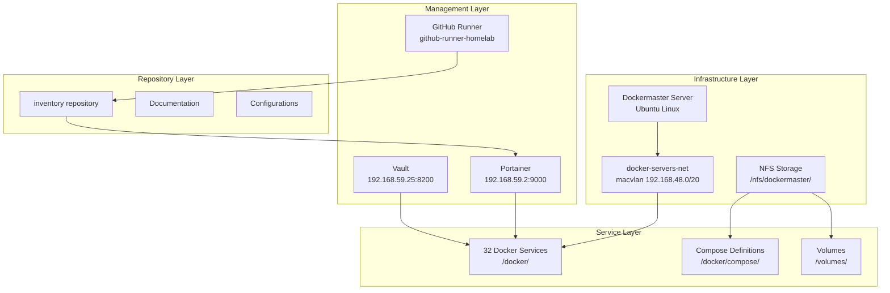

# Project Requirements Document: Dockermaster Infrastructure Recovery

## Executive Summary

The Dockermaster Infrastructure Recovery project addresses critical infrastructure management challenges in a home laboratory environment running 32 Docker services. Currently experiencing git repository conflicts and lacking comprehensive documentation for 62.5% of services, this project will establish a robust, automated infrastructure management system with centralized secret management and GitOps deployment capabilities.

This initiative will transform the fragmented infrastructure into a fully documented, automated, and secure system by resolving git conflicts, documenting all services, integrating Vault for secret management, configuring Portainer for GitOps workflows, and enhancing the existing CI/CD pipeline. The project employs a manager-agent architecture to ensure systematic execution while maintaining zero service disruption throughout the implementation.

Expected outcomes include 100% service documentation coverage, complete deployment automation, centralized secret management through Vault, and an 80% reduction in manual deployment time. The implementation spans 34 hours over 5-7 days, with critical user interaction required for Vault configuration.

## Project Metadata

- **Document Version:** 1.1.0
- **Created Date:** 2025-08-28T19:00:00Z
- **Last Updated:** 2025-08-28T20:00:00Z
- **Status:** Draft
- **Stakeholders:** Home Lab Administrator, DevOps Team

## 1. Business Requirements

### 1.1 Problem Statement

The home laboratory infrastructure currently faces significant operational and security challenges that impede efficient service management and deployment. With 32 Docker services running on the dockermaster server, only 12 (37.5%) are properly documented in the repository. The recent merge of PR #3 (github-runner-cicd) to the remote main branch has created git conflicts in the local dockermaster-config branch, preventing clean repository operations. Additionally, secrets are scattered across configuration files without centralized management, Vault service is deployed but unhealthy, and Portainer lacks GitOps integration for automated deployments. These issues result in manual deployment processes prone to human error, increased operational risk due to undocumented services, security vulnerabilities from distributed secret management, and delayed development velocity from documentation gaps.

**Undocumented Services by Priority:**
- **High Priority (4)**: github-runner, vault, keycloak, prometheus
- **Medium Priority (1)**: rabbitmq
- **Low Priority (10)**: ansible-stack, bitwarden, docspell, fluentd, ghost.io, kafka, mongodb, opentelemetry-home, otel, solr
- **Special Cases (5)**: pablo (personal), prometheus.new (testing), grafana(old) (deprecated), home-lab-inventory (meta-repo), network (config only)

### 1.2 Business Objectives

- **Objective 1**: Achieve 100% service documentation coverage (currently 37.5%) within 7 days, measured by completed service documentation files in the repository
- **Objective 2**: Implement fully automated deployment pipeline reducing manual deployment time by 80%, measured by deployment time metrics before and after implementation
- **Objective 3**: Establish centralized secret management with 100% of services using Vault for sensitive data, measured by services configured with Vault integration
- **Objective 4**: Create comprehensive monitoring and alerting for all 32 services, measured by configured health checks and alert rules
- **Objective 5**: Ensure zero service disruption during implementation, measured by service uptime monitoring throughout the project

### 1.3 Success Metrics

- **Documentation Coverage**: Increase from 12/32 (37.5%) to 32/32 (100%) services documented
- **Deployment Automation**: 100% of services deployable via GitOps workflow
- **Secret Security**: 100% of secrets migrated to Vault with proper access controls
- **Deployment Speed**: Reduction from average 30 minutes manual deployment to <6 minutes automated
- **Repository Health**: Clean git status with no conflicts and synchronized branches
- **Service Availability**: Maintain 100% uptime for critical services during implementation

## 2. Functional Requirements

### 2.1 Core Features

**Git Repository Management**
- Resolve existing conflicts in dockermaster-config branch
- Preserve documentation improvements during conflict resolution
- Establish clean repository state synchronized with remote
- Acceptance Criteria: Git status shows no conflicts, all branches synchronized

**Service Documentation System**
- Document all 32 Docker services with standardized templates
- Include configuration, dependencies, environment variables, and deployment procedures
- Create searchable service inventory with cross-references
- Acceptance Criteria: All services have complete documentation following template standards

**Secret Management Integration**
- Configure Vault service to healthy operational state
- Migrate all service secrets to Vault with proper organization
- Implement secret injection mechanisms for Docker services
- Acceptance Criteria: Vault healthy, all secrets centralized, services successfully retrieve secrets

**GitOps Deployment Automation**
- Configure Portainer with repository integration
- Implement webhook-based automated deployments
- Create deployment templates for service categories
- Acceptance Criteria: Push to main branch triggers automatic deployment

**CI/CD Pipeline Enhancement**
- Integrate existing GitHub runner with deployment workflows
- Implement validation, testing, and deployment stages
- Configure monitoring and alerting for deployments
- Acceptance Criteria: Complete pipeline executes successfully for all services

### 2.2 User Stories

- As a **system administrator**, I want **all services documented** so that **I can understand dependencies and configurations**
- As a **DevOps engineer**, I want **automated deployments** so that **I can reduce manual errors and save time**
- As a **security officer**, I want **centralized secret management** so that **sensitive data is properly protected**
- As a **operations manager**, I want **deployment monitoring** so that **I can track system health and performance**
- As a **developer**, I want **GitOps workflow** so that **I can deploy changes through version control**
- As a **user**, I want **zero service disruption** so that **my applications remain available during updates**

### 2.3 Use Cases

**UC1: Resolve Git Conflicts**
- Preconditions: Repository in conflict state after PR #3 (github-runner-cicd) merge to remote
- Steps:
  1. Abort current rebase operation
  2. Backup documentation changes (docs/dockermaster-sync-report.md, CLAUDE.md updates)
  3. Reset to origin/main or origin/dockermaster-config branch
  4. Reapply documentation improvements from backup
  5. Commit and push changes
- Postconditions: Clean repository state with preserved documentation

**UC2: Document New Service**
- Preconditions: Service running on dockermaster without documentation
- Steps:
  1. SSH to dockermaster server
  2. Analyze service docker-compose.yml
  3. Extract configuration parameters
  4. Create documentation following template
  5. Update service inventory
- Postconditions: Service fully documented in repository

**UC3: Deploy Service Update**
- Preconditions: Service configuration updated in repository
- Steps:
  1. Push changes to main branch
  2. GitHub webhook triggers Portainer
  3. Portainer pulls latest configuration
  4. Service deploys with new configuration
  5. Health checks validate deployment
- Postconditions: Service running with updated configuration

## 3. Technical Requirements

### 3.1 Architecture



**Directory Structure (No Restructuring Needed):**
- **Live Services**: `/nfs/dockermaster/docker/<service_name>/` - Where services actually run
- **CD Source**: `/nfs/dockermaster/docker/compose/<service_name>/` - Deployment configurations
- **Repository Mirror**: `/deployment/<service_name>/` - Read-only access for GitHub runner
- **Note**: The dockermaster directory structure is already correct and requires no changes

**Network IP Assignments:**
- 192.168.59.2 - Portainer
- 192.168.59.20 - Prometheus  
- 192.168.59.21 - Grafana
- 192.168.59.25 - Vault
- 192.168.59.28 - Nginx Reverse Proxy
- 192.168.59.30 - N8N

### 3.2 Technology Stack

- **Container Runtime**: Docker CE 24.0.x with Docker Compose v2
- **Orchestration**: Portainer CE 2.19.x for container management
- **Secret Management**: HashiCorp Vault 1.16.x for centralized secrets
- **CI/CD**: GitHub Actions with self-hosted runner v2.311.x
- **Version Control**: Git 2.x with GitHub repository
- **Operating System**: Ubuntu 22.04 LTS (dockermaster server)
- **Network**: macvlan driver for container networking
- **Storage**: NFS mounted at /nfs/dockermaster/
- **Monitoring**: Portainer built-in monitoring with webhook integration

### 3.3 APIs and Integrations

**GitHub API v3/v4**
- Webhook events for push and pull_request
- Repository content management
- Deployment status updates
- Format: REST/GraphQL, Authentication: Personal Access Token

**Vault HTTP API v1**
- Secret storage and retrieval at path `secret/dockermaster/<service>`
- Authentication methods: userpass, token
- Health check endpoint: `/v1/sys/health`
- Format: REST, Authentication: Token-based

**Portainer API**
- Stack deployment and management
- Webhook endpoints for GitOps
- Environment and endpoint configuration
- Format: REST, Authentication: JWT token

**Docker API**
- Container lifecycle management
- Network and volume operations
- Health check execution
- Format: REST/Socket, Authentication: Local socket

### 3.4 Data Requirements

**Service Documentation Data Model**
```yaml
service:
  name: string (required)
  description: string (required)
  image: string (required)
  version: string (required)
  ports: array<port_mapping>
  volumes: array<volume_mapping>
  environment: array<env_variable>
  dependencies: array<service_name>
  health_check: object
  deployment_notes: string
```

**Secret Storage Structure**
```
vault://secret/
├── dockermaster/
│   ├── <service_name>/
│   │   ├── database_password
│   │   ├── api_key
│   │   └── certificates
├── infrastructure/
│   ├── github_token
│   └── portainer_admin
```

**Retention Policies**
- Service logs: 30 days rolling retention
- Deployment history: 90 days in Portainer
- Vault audit logs: 180 days
- Git history: Permanent retention

## 4. Non-Functional Requirements

### 4.1 Performance

- **Deployment Time**: Maximum 6 minutes from git push to service running
- **Service Startup**: Maximum 30 seconds for container initialization
- **API Response Time**: Vault API responses within 100ms
- **Webhook Processing**: Portainer webhook execution within 5 seconds
- **Documentation Build**: Repository documentation generation within 10 seconds
- **Network Throughput**: Minimum 100Mbps between services on docker-servers-net
- **Concurrent Deployments**: Support up to 5 simultaneous service deployments

### 4.2 Security

**Authentication Requirements**
- Vault authentication using userpass method with MFA
- Portainer authentication with role-based access control
- GitHub runner authentication with repository-scoped tokens
- SSH key-based authentication for dockermaster access

**Authorization Requirements**
- Principle of least privilege for all service accounts
- Segregated Vault policies per service
- Read-only access for monitoring systems
- Write access restricted to CI/CD pipeline

**Encryption Requirements**
- TLS 1.2+ for all API communications
- Encrypted storage for Vault data at rest
- SSH connections using ED25519 or RSA 4096-bit keys
- Secrets never stored in plain text in repositories

**Compliance Requirements**
- OWASP Docker Security Top 10 compliance
- CIS Docker Benchmark adherence
- Regular security scanning of container images
- Audit logging for all administrative actions

### 4.3 Reliability

- **Service Uptime Target**: 99.9% availability (43 minutes downtime/month)
- **Deployment Success Rate**: 95% successful automated deployments
- **Backup Frequency**: Daily automated backups of configurations
- **Recovery Time Objective (RTO)**: 1 hour for critical services
- **Recovery Point Objective (RPO)**: 24 hours for configuration data
- **Disaster Recovery**: Documented procedures for full system recovery
- **Rollback Capability**: Automated rollback within 2 minutes of failure detection

### 4.4 Usability

- **Documentation Standards**: Markdown format with consistent templates
- **User Interface**: Web-based management through Portainer
- **Command Line Interface**: Standardized scripts for common operations
- **Error Messages**: Clear, actionable error descriptions with remediation steps
- **Training Materials**: Video tutorials and written guides for all procedures
- **Accessibility**: WCAG 2.1 AA compliance for web interfaces
- **Language Support**: English documentation and interfaces

## 5. Constraints and Dependencies

### 5.1 Technical Constraints

- **Platform Limitation**: dockermaster server limited to 32GB RAM and 8 CPU cores
- **Network Constraint**: macvlan network requires specific IP range (192.168.59.0/26)
- **Storage Limitation**: NFS storage limited to 2TB available space
- **Docker Version**: Must maintain compatibility with Docker CE 24.0.x
- **GitHub Runner**: Read-only access to /deployment directory
- **Vault Memory**: Requires minimum 512MB RAM allocation
- **Concurrent Connections**: Maximum 100 simultaneous Portainer sessions

### 5.2 Business Constraints

- **Timeline**: Project must complete within 7 days
- **Resource Availability**: Single administrator for implementation
- **Budget**: Zero additional cost (use existing infrastructure)
- **Change Window**: Implementations only during 6pm-10pm local time
- **User Availability**: User interaction for Vault limited to specific time slots
- **Training Time**: Maximum 2 hours for user training sessions
- **Documentation Language**: English only for all documentation

### 5.3 External Dependencies

- **GitHub Service**: Repository hosting and webhook delivery
- **Docker Hub**: Container image registry availability
- **DNS Resolution**: Internal DNS server (192.168.48.1) availability
- **NFS Server**: Network storage accessibility
- **Internet Connectivity**: Required for package updates and image pulls
- **Time Synchronization**: NTP service for consistent timestamps
- **SSL Certificates**: Let's Encrypt for TLS certificates

## 6. Risk Analysis

### 6.1 Technical Risks

**Risk: Vault Configuration Failure**
- Description: Vault service fails to initialize properly
- Probability: Medium (40%)
- Impact: High - Blocks secret management migration
- Mitigation: Maintain parallel file-based secrets during transition, comprehensive backup of Vault configuration

**Risk: Service Dependency Conflicts**
- Description: Undocumented dependencies cause service failures
- Probability: Medium (30%)
- Impact: Medium - Individual service disruptions
- Mitigation: Thorough dependency mapping in documentation phase, staged deployment approach

**Risk: Network Configuration Issues**
- Description: macvlan network changes affect connectivity
- Probability: Low (10%)
- Impact: High - Multiple service outages
- Mitigation: No network changes planned, comprehensive network documentation, quick rollback procedures

**Risk: GitHub Runner Failure**
- Description: CI/CD pipeline disruption from runner issues
- Probability: Low (15%)
- Impact: Medium - Delayed deployments
- Mitigation: Manual deployment fallback procedures, runner health monitoring

### 6.2 Business Risks

**Risk: Extended Implementation Timeline**
- Description: Project exceeds 7-day timeline
- Probability: Medium (35%)
- Impact: Medium - Delayed benefits realization
- Mitigation: Phased approach allows partial completion, priority-based implementation

**Risk: User Adoption Challenges**
- Description: User struggles with new Vault interface
- Probability: Medium (40%)
- Impact: Low - Temporary productivity impact
- Mitigation: Comprehensive training materials, gradual responsibility transfer

**Risk: Documentation Maintenance Burden**
- Description: Documentation becomes outdated quickly
- Probability: High (60%)
- Impact: Low - Reduced documentation value
- Mitigation: Automated documentation generation where possible, regular review cycles

## 7. Implementation Plan

### 7.1 Phases

**Phase 1: Git Recovery (2 hours)**
- Deliverables: Clean repository state, preserved documentation
- Key Files to Preserve:
  - docs/dockermaster-sync-report.md
  - CLAUDE.md (with service structure updates)
- Success Criteria: No git conflicts, branches synchronized with origin/main
- Dependencies: Repository access, backup storage

**Phase 2: Repository Cleanup (4 hours)**
- Deliverables: Optimized structure, templates, updated .gitignore
- Key Tasks:
  - Remove dockermaster-live/ directory (700MB+ of synced data)
  - Update .gitignore to exclude dockermaster-live/ and .history/
- Success Criteria: Clean repository without temporary sync directories
- Dependencies: Phase 1 completion

**Phase 3: Service Documentation (12 hours)**
- Deliverables: 32 complete service documentation files
- Priority Order:
  - High Priority: github-runner, vault, keycloak, prometheus
  - Medium Priority: rabbitmq
  - Low Priority: ansible-stack, bitwarden, docspell, fluentd, ghost.io, kafka, mongodb, opentelemetry-home, otel, solr
  - Special handling for deprecated/meta services
- Success Criteria: 100% service coverage
- Dependencies: SSH access to dockermaster

**Phase 4: Vault Integration (6 hours)**
- Deliverables: Healthy Vault service, migrated secrets
- Success Criteria: Vault operational, secrets accessible
- Dependencies: User availability for interactive setup

**Phase 5: Portainer GitOps (4 hours)**
- Deliverables: Webhook automation, deployment templates
- Success Criteria: Automated deployments functional
- Dependencies: Vault service healthy

**Phase 6: CI/CD Enhancement (6 hours)**
- Deliverables: Complete automation pipeline
- Success Criteria: All services deployable via pipeline
- Dependencies: All previous phases complete

### 7.2 Milestones

- **Day 1 End**: Repository clean, structure optimized (Phases 1-2)
- **Day 2 End**: 50% services documented (Phase 3 partial)
- **Day 3 End**: All services documented (Phase 3 complete)
- **Day 4 End**: Vault operational with secrets migrated (Phase 4)
- **Day 5 End**: GitOps configured and tested (Phase 5)
- **Day 7 End**: Full automation operational (Phase 6)

### 7.3 Resource Requirements

**Team Composition**
- Project Manager Agent: Overall coordination and quality assurance
- 6 Specialized Agents: Phase-specific implementation
- System Administrator: User interaction and validation
- Technical Reviewer: Documentation and quality review

**Skills Required**
- Docker and Docker Compose expertise
- Git conflict resolution experience
- Vault configuration knowledge
- Portainer administration skills
- CI/CD pipeline development
- Technical documentation writing

**Tools Required**
- SSH client for server access
- Git command line tools
- Text editor for documentation
- Web browser for UI access
- Terminal multiplexer for session management

## 8. Testing Strategy

### 8.1 Test Scenarios

**Unit Testing**
- Individual service configuration validation
- Docker Compose syntax verification
- Environment variable substitution
- Volume mount accessibility

**Integration Testing**
- Service-to-service communication
- Vault secret retrieval
- Webhook trigger validation
- Network connectivity verification

**System Testing**
- End-to-end deployment pipeline
- Multi-service deployment scenarios
- Rollback procedures
- Monitoring and alerting

**Acceptance Testing**
- User deployment initiation
- Documentation navigation
- Vault management operations
- Service health verification

### 8.2 Quality Assurance

**Code Review Process**
- All configuration changes require review
- Documentation reviewed for completeness
- Security review for secret handling
- Performance review for resource usage

**Quality Gates**
- Phase completion requires explicit approval
- Automated validation before deployment
- Security scanning of container images
- Documentation completeness check

## 9. Deployment Strategy

### 9.1 Environments

**Development Environment**
- Local Docker installation for testing
- Isolated network for experimentation
- Mock services for dependency testing
- Specifications: 4GB RAM, 2 CPU cores

**Staging Environment**
- Subset of production services
- Same network configuration as production
- Full Vault integration
- Specifications: 8GB RAM, 4 CPU cores

**Production Environment**
- Dockermaster server (192.168.59.x)
- 32 production services
- docker-servers-net macvlan network
- Specifications: 32GB RAM, 8 CPU cores

### 9.2 Release Process

**CI/CD Pipeline Stages**
1. Code checkout from repository
2. Configuration validation (YAML lint)
3. Security scanning (container images)
4. Build verification
5. Automated testing
6. Deployment to staging
7. Health check validation
8. Production deployment
9. Post-deployment verification

**Rollback Procedures**
1. Detect failure through health checks
2. Trigger automatic rollback
3. Restore previous configuration
4. Verify service recovery
5. Generate incident report
6. Manual intervention if automatic rollback fails

## 10. Maintenance and Support

### 10.1 Monitoring

**Metrics Collection**
- Service health status (up/down)
- Response times and latency
- Resource utilization (CPU, memory, disk)
- Network traffic patterns
- Deployment success rates

**Alert Configuration**
- Service down > 1 minute: Critical
- Memory usage > 80%: Warning
- Disk usage > 90%: Critical
- Deployment failure: High
- Vault unavailable: Critical

**Dashboards**
- Service overview dashboard
- Deployment pipeline status
- Resource utilization trends
- Secret rotation tracking
- Incident response metrics

### 10.2 Documentation

**User Guides**
- Service deployment procedures
- Vault secret management
- Troubleshooting common issues
- Disaster recovery procedures

**API Documentation**
- Vault API endpoints and usage
- Portainer API integration
- Webhook payload formats
- Service health check endpoints

**Runbooks**
- Service restart procedures
- Secret rotation process
- Backup and restore operations
- Network troubleshooting
- Performance optimization

## Appendices

### A. Glossary

- **CI/CD**: Continuous Integration/Continuous Deployment
- **GitOps**: Git-based operations and deployment workflow
- **macvlan**: Docker network driver for direct network access
- **Vault**: HashiCorp secret management solution
- **Portainer**: Container management platform
- **Webhook**: HTTP callback for event notifications
- **Docker Compose**: Multi-container application definition
- **NFS**: Network File System for shared storage

### B. References

- [Docker Documentation](https://docs.docker.com/)
- [Docker Compose Specification](https://docs.docker.com/compose/compose-file/)
- [Vault Documentation](https://developer.hashicorp.com/vault/docs)
- [Portainer Documentation](https://docs.portainer.io/)
- [GitHub Actions Documentation](https://docs.github.com/en/actions)
- [OWASP Docker Security](https://owasp.org/www-project-docker-security/)
- [CIS Docker Benchmark](https://www.cisecurity.org/benchmark/docker)
- [RFC 2119 - Requirement Keywords](https://www.ietf.org/rfc/rfc2119.txt)

### C. Version History

| Version | Date | Author | Changes |
|---------|------|--------|---------|
| 1.0.0 | 2025-08-28 | PRD Specialist | Initial document creation |
| 1.1.0 | 2025-08-28 | PRD Specialist | Added specific service lists, directory clarifications, and network IP assignments |
